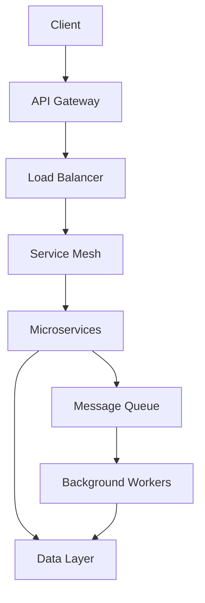

# AriesOne SaaS Architecture Guide

Version: 1.0.0
Last Updated: 2025-01-10

## System Overview

AriesOne SaaS is a multi-tenant healthcare equipment management system built on modern cloud-native architecture principles.

### Key Features
- Multi-tenant isolation
- Real-time inventory tracking
- Order management
- Equipment maintenance scheduling
- Billing and invoicing
- Analytics and reporting

## Architecture Principles

1. **Cloud Native**
   - Containerized microservices
   - Kubernetes orchestration
   - Horizontal scalability
   - Infrastructure as Code

2. **Security First**
   - Zero trust architecture
   - End-to-end encryption
   - Regular security audits
   - HIPAA compliance

3. **High Availability**
   - Multi-region deployment
   - Automated failover
   - Load balancing
   - Data replication

4. **Observability**
   - Distributed tracing
   - Metrics aggregation
   - Centralized logging
   - Performance monitoring

## System Components

### 1. Frontend Layer
- React.js SPA
- Redux state management
- Material-UI components
- PWA capabilities

### 2. API Gateway
- Kong API Gateway
- Rate limiting
- Request routing
- Authentication/Authorization

### 3. Microservices
- User Service
- Tenant Service
- Inventory Service
- Order Service
- Billing Service
- Analytics Service

### 4. Data Layer
- PostgreSQL (primary data store)
- Redis (caching)
- Elasticsearch (search)
- MinIO (object storage)

### 5. Message Queue
- RabbitMQ
- Dead letter queues
- Message persistence
- Event sourcing

## Data Flow

## Security Architecture

### 1. Authentication
- OAuth2/OpenID Connect
- JWT tokens
- API key management
- SSO integration

### 2. Authorization
- RBAC (Role-Based Access Control)
- Tenant isolation
- Resource-level permissions
- API scope control

### 3. Data Security
- At-rest encryption
- In-transit encryption
- Data masking
- Audit logging

### 4. Network Security
- VPC isolation
- WAF (Web Application Firewall)
- DDoS protection
- Network segmentation

## Scalability

### 1. Application Scaling
- Horizontal pod autoscaling
- Custom metrics scaling
- Scheduled scaling
- Burst handling

### 2. Database Scaling
- Read replicas
- Connection pooling
- Query optimization
- Table partitioning

### 3. Cache Strategy
- Multi-level caching
- Cache invalidation
- Cache warming
- Distribution

## High Availability

### 1. Redundancy
- Multi-AZ deployment
- Service replication
- Data mirroring
- Failover systems

### 2. Disaster Recovery
- Automated backups
- Point-in-time recovery
- Cross-region replication
- Recovery testing

### 3. Load Balancing
- Layer 7 load balancing
- Session affinity
- Health checks
- Circuit breaking

## Monitoring

### 1. Metrics
- System metrics
- Business metrics
- Custom metrics
- SLO/SLI tracking

### 2. Logging
- Structured logging
- Log aggregation
- Log retention
- Log analysis

### 3. Alerting
- Alert thresholds
- Alert routing
- Incident management
- Escalation policies

## Deployment

### 1. CI/CD Pipeline
- Source control
- Automated testing
- Security scanning
- Deployment automation

### 2. Environment Strategy
- Development
- Staging
- Production
- DR site

### 3. Release Management
- Feature flags
- Canary releases
- Blue-green deployments
- Rollback procedures

## Performance

### 1. Optimization
- Query optimization
- Caching strategy
- Asset optimization
- Code minification

### 2. Benchmarks
- Response time < 200ms
- 99.9% uptime
- < 1% error rate
- < 1s page load

### 3. Capacity Planning
- Resource monitoring
- Usage forecasting
- Scaling thresholds
- Cost optimization

## Integration Points

### 1. External Systems
- EHR systems
- Payment gateways
- Shipping providers
- Analytics platforms

### 2. APIs
- REST APIs
- GraphQL
- Webhooks
- Event streams

### 3. Authentication
- SAML
- OAuth2
- LDAP
- Active Directory

## Development

### 1. Technology Stack
- Frontend: React.js
- Backend: Python/FastAPI
- Database: PostgreSQL
- Cache: Redis

### 2. Development Tools
- Git
- Docker
- Kubernetes
- Terraform

### 3. Testing Strategy
- Unit testing
- Integration testing
- E2E testing
- Performance testing

## Support and Operations

### 1. Documentation
- API documentation
- User guides
- Runbooks
- Architecture diagrams

### 2. Monitoring
- System health
- Performance metrics
- Error tracking
- Usage analytics

### 3. Incident Response
- On-call rotation
- Incident management
- Post-mortems
- Improvement tracking

## Future Roadmap

### 1. Technical Improvements
- GraphQL API
- Event sourcing
- Machine learning
- Blockchain integration

### 2. Feature Enhancements
- Mobile app
- Advanced analytics
- IoT integration
- AI-driven insights

### 3. Infrastructure Updates
- Multi-cloud support
- Edge computing
- Serverless adoption
- Container optimization
