# Data Flow Documentation

## Core Data Flows

### 1. Company Management Flow

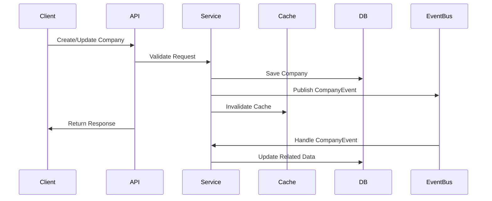

### 2. Authentication Flow

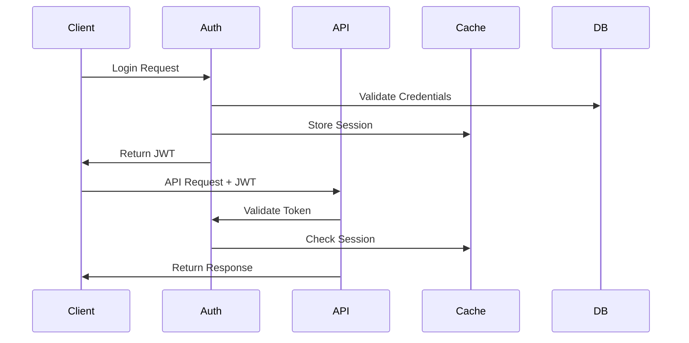

### 3. Event Processing Flow

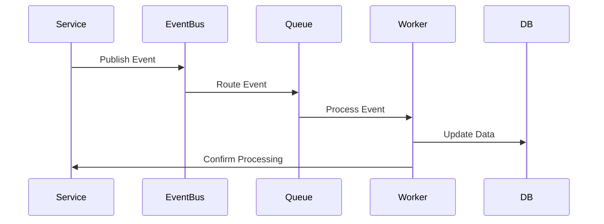

## Data Access Patterns

### 1. Read Operation
```
Client Request
    ↓
Check Cache
    ↓
Cache Hit → Return Data
    ↓
Cache Miss → Query DB
    ↓
Update Cache
    ↓
Return Data
```

### 2. Write Operation
```
Client Request
    ↓
Validate Input
    ↓
Begin Transaction
    ↓
Update DB
    ↓
Publish Event
    ↓
Commit Transaction
    ↓
Invalidate Cache
    ↓
Return Response
```

### 3. Batch Operation
```
Client Request
    ↓
Validate Batch
    ↓
Queue Task
    ↓
Process Async
    ↓
Update DB
    ↓
Send Notification
```

## Integration Flows

### 1. External API Integration

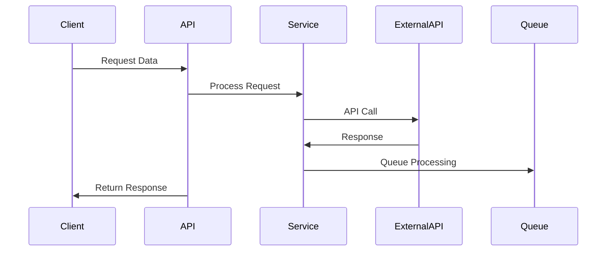

### 2. Message Queue Integration

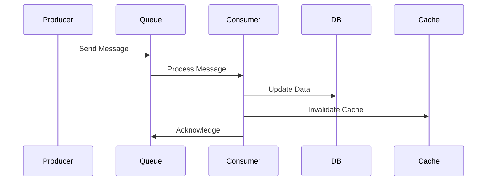

## Error Handling Flows

### 1. API Error Flow

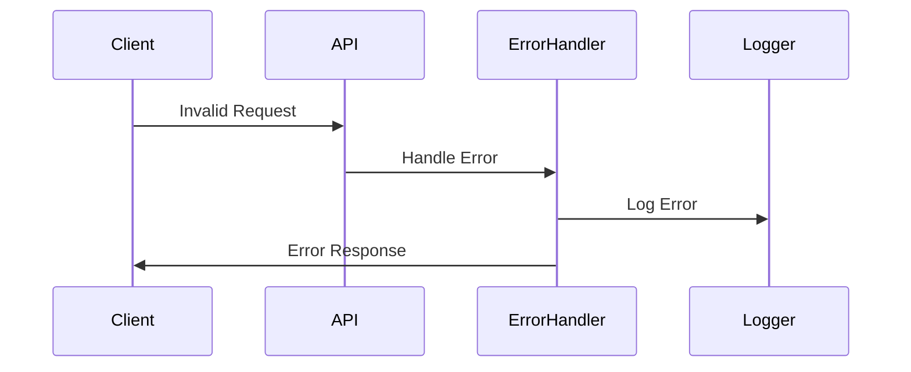

### 2. Transaction Rollback Flow

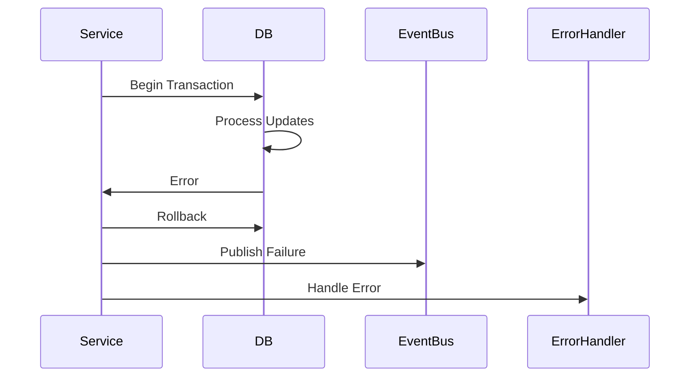

## Cache Management Flows

### 1. Cache Update Flow

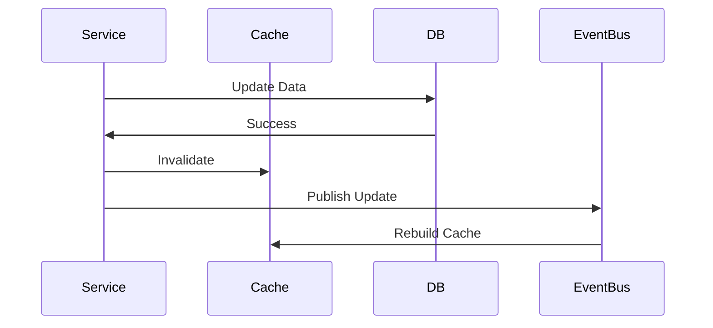

### 2. Cache Distribution Flow

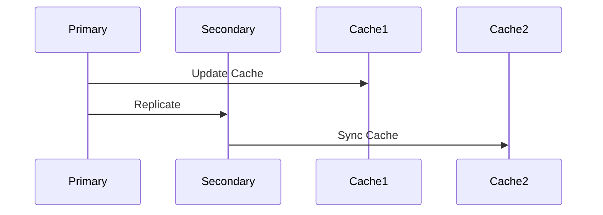

## Monitoring Flows

### 1. Metrics Collection

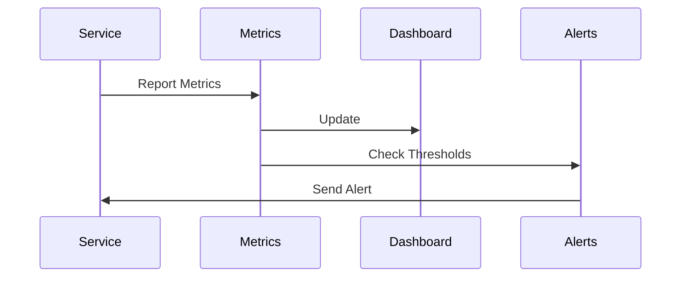

### 2. Audit Logging

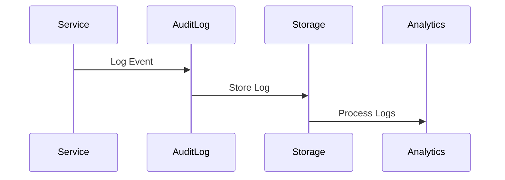
