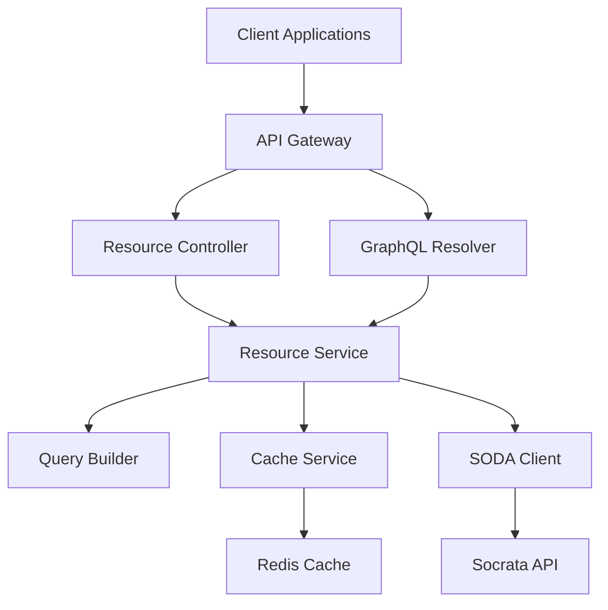
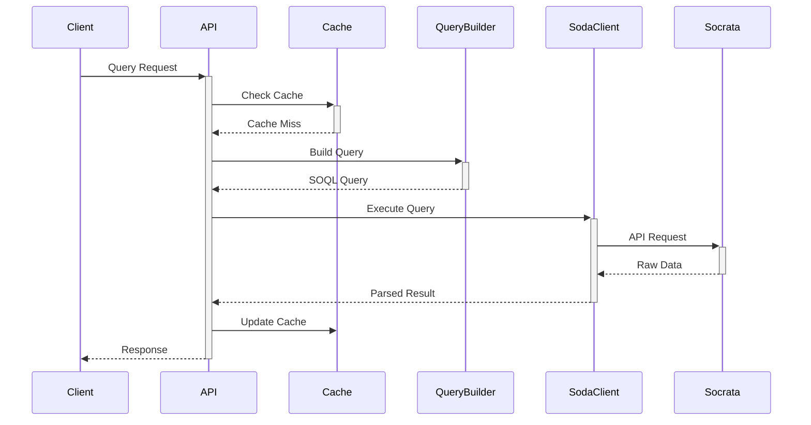
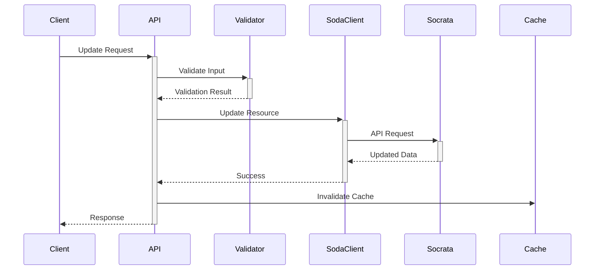
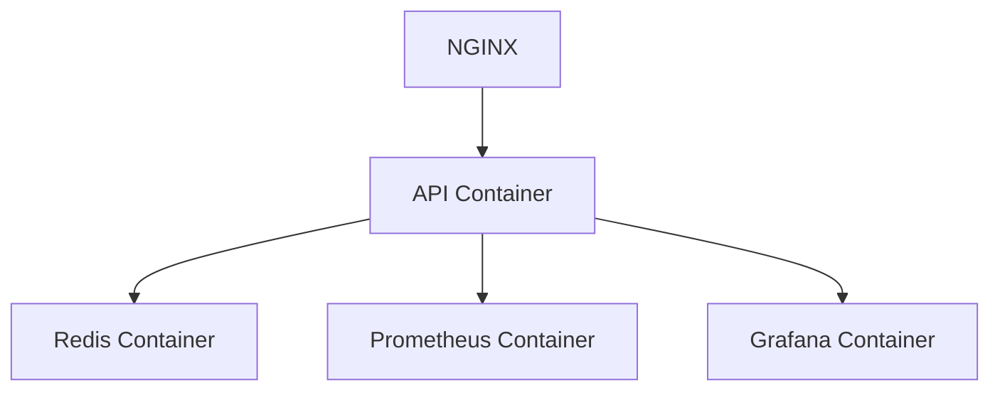

# SODA Module Architecture

## Overview
The modernized SODA module follows Clean Architecture principles, implementing Domain-Driven Design (DDD) patterns to ensure maintainability, testability, and scalability.

## Architecture Layers

### 1. Domain Layer
```typescript
// Core domain entities
interface Resource {
  id: string;
  name: string;
  description?: string;
  columns: Column[];
  metadata: ResourceMetadata;
}

interface Column {
  name: string;
  dataType: DataType;
  description?: string;
  isRequired: boolean;
}

interface ResourceMetadata {
  createdAt: Date;
  updatedAt: Date;
  owner: string;
  license?: string;
}
```

### 2. Application Layer
```typescript
// Use cases and business logic
interface ResourceService {
  getResource(id: string): Promise<Resource>;
  queryResource(query: SoqlQuery): Promise<QueryResult>;
  updateResource(id: string, data: Partial<Resource>): Promise<Resource>;
  deleteResource(id: string): Promise<void>;
}

interface QueryBuilder {
  select(columns: string[]): QueryBuilder;
  where(condition: WhereClause): QueryBuilder;
  orderBy(column: string, direction: OrderDirection): QueryBuilder;
  limit(count: number): QueryBuilder;
  offset(count: number): QueryBuilder;
  build(): SoqlQuery;
}
```

### 3. Infrastructure Layer
```typescript
// External integrations and implementations
interface SodaClient {
  execute<T>(request: SodaRequest): Promise<SodaResult<T>>;
  getMetadata(resourceId: string): Promise<ResourceMetadata>;
  getRawData(query: string): Promise<RawData>;
}

interface CacheService {
  get<T>(key: string): Promise<T | null>;
  set<T>(key: string, value: T, ttl?: number): Promise<void>;
  delete(key: string): Promise<void>;
}
```

### 4. Presentation Layer
```typescript
// API interfaces
interface ResourceController {
  get(req: Request): Promise<Response>;
  query(req: Request): Promise<Response>;
  update(req: Request): Promise<Response>;
  delete(req: Request): Promise<Response>;
}

interface GraphQLResolvers {
  Query: {
    resource(parent: any, args: any, context: Context): Promise<Resource>;
    resources(parent: any, args: any, context: Context): Promise<Resource[]>;
  };
  Mutation: {
    updateResource(parent: any, args: any, context: Context): Promise<Resource>;
  };
}
```

## Component Diagram


## Data Flow

### 1. Query Execution Flow


### 2. Resource Update Flow


## Security Architecture

### 1. Authentication
```typescript
interface AuthService {
  validateToken(token: string): Promise<boolean>;
  refreshToken(token: string): Promise<string>;
  revokeToken(token: string): Promise<void>;
}

interface AuthMiddleware {
  authenticate(req: Request): Promise<AuthResult>;
  authorize(req: Request, roles: string[]): Promise<boolean>;
}
```

### 2. Rate Limiting
```typescript
interface RateLimiter {
  checkLimit(key: string): Promise<boolean>;
  incrementUsage(key: string): Promise<void>;
  getRemainingLimit(key: string): Promise<number>;
}
```

## Performance Optimizations

### 1. Caching Strategy
```typescript
interface CacheConfig {
  defaultTTL: number;
  maxSize: number;
  evictionPolicy: 'LRU' | 'LFU';
}

interface CacheManager {
  getOrSet<T>(key: string, fetch: () => Promise<T>): Promise<T>;
  invalidatePattern(pattern: string): Promise<void>;
  clearAll(): Promise<void>;
}
```

### 2. Connection Pooling
```typescript
interface ConnectionPool {
  acquire(): Promise<Connection>;
  release(connection: Connection): Promise<void>;
  status(): PoolStatus;
}
```

## Error Handling

### 1. Error Hierarchy
```typescript
class SodaError extends Error {}
class ValidationError extends SodaError {}
class AuthenticationError extends SodaError {}
class RateLimitError extends SodaError {}
```

### 2. Error Response Format
```typescript
interface ErrorResponse {
  statusCode: number;
  message: string;
  code: string;
  details?: Record<string, any>;
}
```

## Monitoring and Metrics

### 1. Health Checks
```typescript
interface HealthCheck {
  checkSocrataConnection(): Promise<boolean>;
  checkCacheConnection(): Promise<boolean>;
  checkDatabaseConnection(): Promise<boolean>;
}
```

### 2. Metrics Collection
```typescript
interface MetricsCollector {
  recordQueryExecution(duration: number): void;
  recordCacheHit(key: string): void;
  recordCacheMiss(key: string): void;
  recordError(error: SodaError): void;
}
```

## Configuration Management

### 1. Environment Configuration
```typescript
interface SodaConfig {
  apiEndpoint: string;
  appToken: string;
  timeout: number;
  retryAttempts: number;
  cacheConfig: CacheConfig;
  rateLimits: RateLimitConfig;
}
```

### 2. Feature Flags
```typescript
interface FeatureFlags {
  enableCaching: boolean;
  enableRateLimiting: boolean;
  enableMetrics: boolean;
  enableGraphQL: boolean;
}
```

## Development Guidelines

### 1. Code Organization
```
src/
├── domain/         # Domain entities and interfaces
├── application/    # Use cases and business logic
├── infrastructure/ # External integrations
├── presentation/   # API interfaces
├── common/         # Shared utilities
└── config/         # Configuration
```

### 2. Testing Strategy
```typescript
interface TestSuite {
  unitTests: Jest.Config;
  integrationTests: Jest.Config;
  e2eTests: Jest.Config;
  performanceTests: K6.Config;
}
```

## Deployment Architecture

### 1. Container Structure


### 2. Scaling Strategy
- Horizontal scaling of API containers
- Redis cluster for caching
- Load balancing across nodes
- Auto-scaling based on metrics

## Future Considerations

### 1. Planned Improvements
- GraphQL subscriptions
- Real-time updates
- Advanced caching
- Machine learning integration

### 2. Technical Debt
- Legacy code migration
- Performance optimization
- Security enhancements
- Documentation updates
