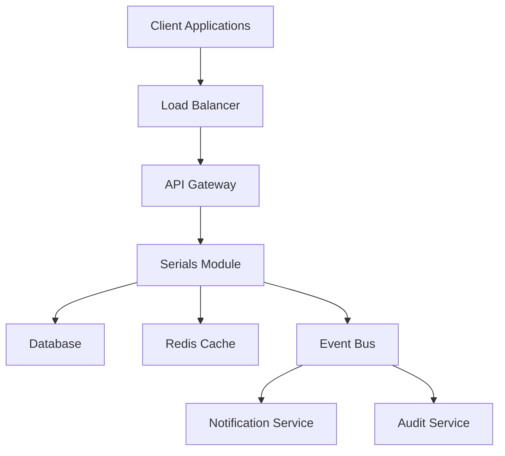
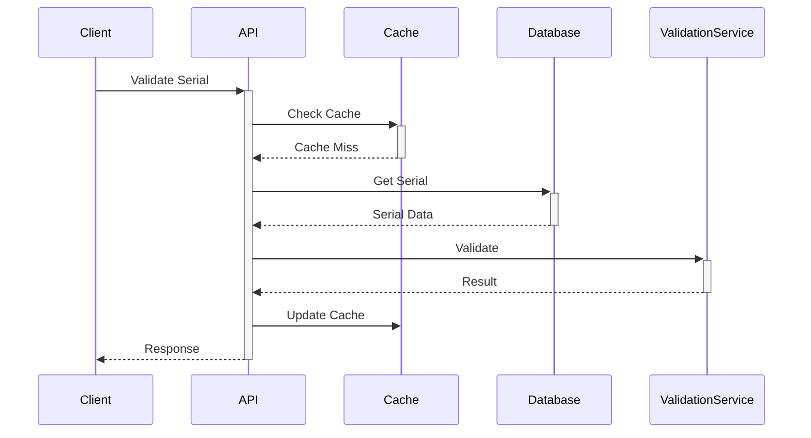
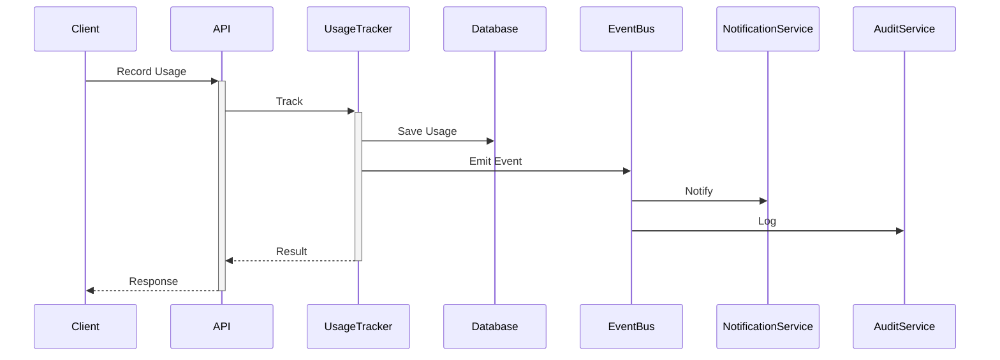
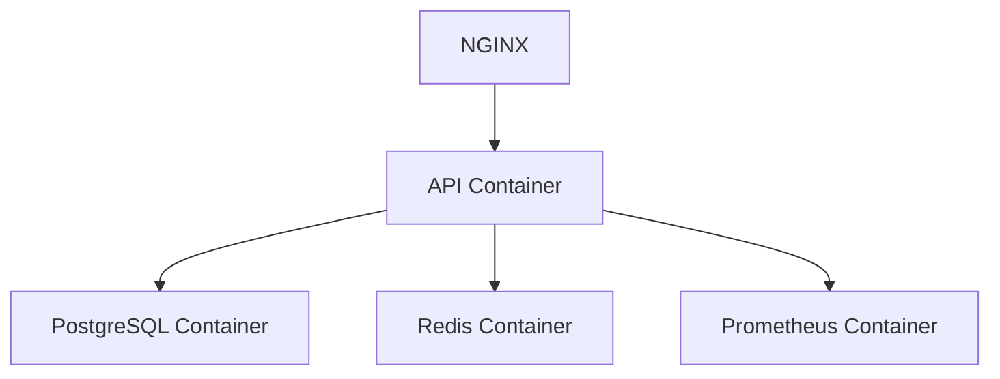

# Serials Module Technical Architecture

## Overview
The Serials Module is designed using a modern, scalable architecture following Domain-Driven Design (DDD) principles. This document outlines the technical architecture, components, and their interactions.

## Architecture Layers

### 1. Presentation Layer
- **REST Controllers**: Handle HTTP requests and responses
- **GraphQL Resolvers**: Process GraphQL queries and mutations
- **WebSocket Gateways**: Manage real-time communications

### 2. Application Layer
- **Services**: Implement business logic and orchestrate operations
- **Event Handlers**: Process domain events and notifications
- **DTOs**: Define data transfer objects for API contracts

### 3. Domain Layer
- **Entities**: Core business objects and relationships
- **Value Objects**: Immutable domain concepts
- **Domain Events**: Business-significant occurrences

### 4. Infrastructure Layer
- **Repositories**: Data access and persistence
- **External Services**: Third-party integrations
- **Cross-cutting Concerns**: Logging, caching, security

## Component Diagram


## Data Flow

### 1. Serial Validation Flow


### 2. Usage Tracking Flow


## Security Architecture

### 1. Authentication
- JWT-based authentication
- Role-based access control
- API key management

### 2. Encryption
- AES-256-GCM for data encryption
- RSA-4096 for digital signatures
- Secure key management

### 3. Rate Limiting
- Per-endpoint limits
- Client-based quotas
- DDoS protection

## Performance Optimizations

### 1. Caching Strategy
- Redis for distributed caching
- Multi-level cache hierarchy
- Cache invalidation patterns

### 2. Database Optimizations
- Indexed queries
- Connection pooling
- Query optimization

### 3. Scalability
- Horizontal scaling
- Load balancing
- Microservices architecture

## Error Handling

### 1. Exception Hierarchy
```typescript
class SerialModuleError extends Error {}
class ValidationError extends SerialModuleError {}
class AuthenticationError extends SerialModuleError {}
class RateLimitError extends SerialModuleError {}
```

### 2. Error Response Format
```json
{
  "statusCode": 400,
  "message": "Validation failed",
  "errors": [
    {
      "field": "serialNumber",
      "message": "Invalid format"
    }
  ]
}
```

## Monitoring and Metrics

### 1. Health Checks
- Database connectivity
- Cache availability
- External services

### 2. Performance Metrics
- Response times
- Error rates
- Resource utilization

### 3. Business Metrics
- Active serials
- Usage patterns
- Client statistics

## Dependencies

### 1. Core Dependencies
- NestJS: Web framework
- TypeORM: ORM
- GraphQL: API
- Redis: Caching

### 2. Security Dependencies
- Passport: Authentication
- node-crypto: Encryption
- helmet: HTTP security

### 3. Monitoring Dependencies
- Prometheus: Metrics
- Winston: Logging
- OpenTelemetry: Tracing

## Configuration Management

### 1. Environment Variables
```env
# Application
NODE_ENV=production
API_PORT=3000
API_PREFIX=/api/v1

# Database
DB_HOST=localhost
DB_PORT=5432
DB_NAME=ariesone

# Redis
REDIS_HOST=localhost
REDIS_PORT=6379

# Security
JWT_SECRET=secret
ENCRYPTION_KEY=key
```

### 2. Feature Flags
```typescript
export const FEATURES = {
  BULK_OPERATIONS: true,
  REAL_TIME_UPDATES: true,
  ADVANCED_ANALYTICS: false,
};
```

## Development Guidelines

### 1. Code Organization
```
src/
├── controllers/     # REST controllers
├── resolvers/      # GraphQL resolvers
├── services/       # Business logic
├── entities/       # Domain models
├── repositories/   # Data access
├── dto/           # Data transfer objects
├── events/        # Event definitions
└── utils/         # Shared utilities
```

### 2. Naming Conventions
- **Files**: kebab-case (e.g., serial-service.ts)
- **Classes**: PascalCase (e.g., SerialService)
- **Methods**: camelCase (e.g., validateSerial)
- **Interfaces**: PascalCase with I prefix (e.g., ISerialRepository)

### 3. Testing Strategy
- Unit tests for business logic
- Integration tests for APIs
- E2E tests for critical flows
- Performance tests for scalability

## Deployment Architecture

### 1. Container Architecture


### 2. Scaling Strategy
- Horizontal scaling of API containers
- Read replicas for database
- Redis cluster for caching
- Load balancing across nodes

### 3. Backup Strategy
- Database backups
- Configuration backups
- Disaster recovery plan

## Future Considerations

### 1. Planned Improvements
- GraphQL subscriptions
- Advanced analytics
- Machine learning integration

### 2. Technical Debt
- Legacy code migration
- Performance optimizations
- Security enhancements

### 3. Scalability Plans
- Multi-region deployment
- Sharding strategy
- Cache optimization
