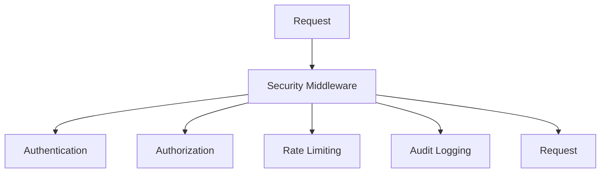
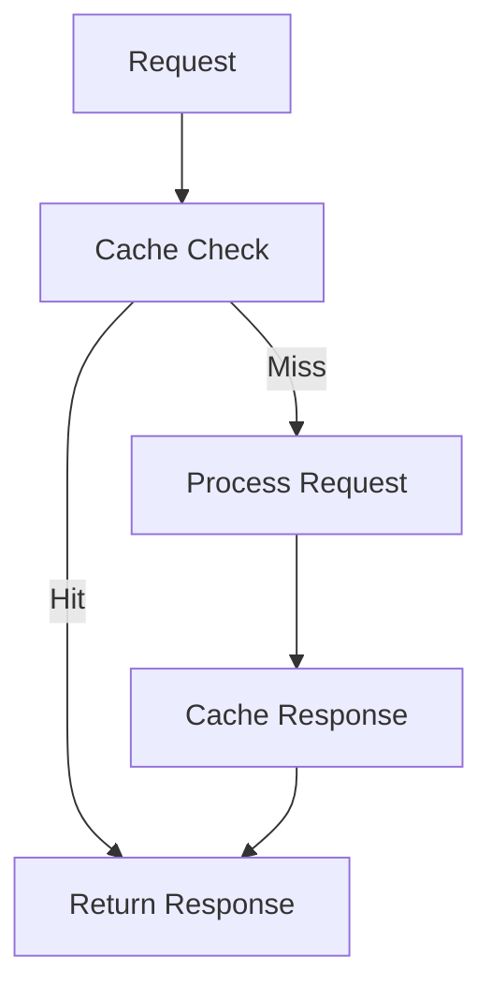
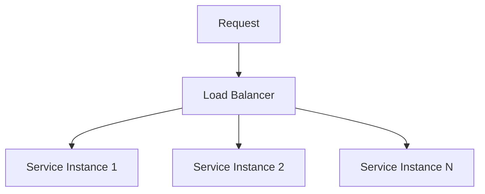
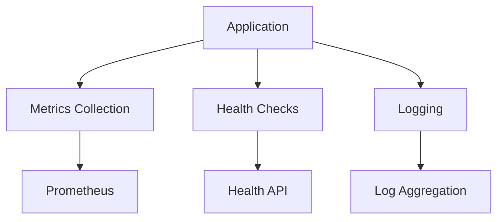
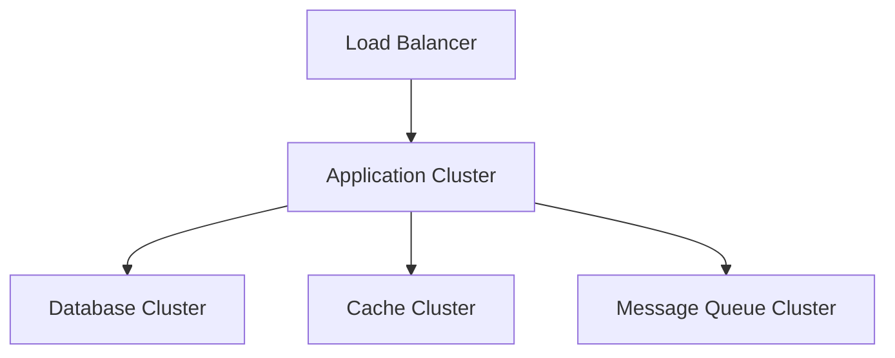

# AriesOne SaaS Architecture

## System Architecture

### Overview
AriesOne SaaS follows a modern, scalable architecture designed to handle the complexities of HME/DME operations. The system is built using a microservices approach with clear separation of concerns and robust integration patterns.

### Key Components

#### API Layer
- **Framework**: FastAPI
- **Features**:
  - REST API endpoints
  - OpenAPI documentation
  - Request validation
  - Response serialization
  - Middleware pipeline

#### Service Layer
- **Pattern**: Domain-driven design
- **Components**:
  - Business logic services
  - Domain models
  - Service orchestration
  - Event handlers
  - Background tasks

#### Data Layer
- **Database**: PostgreSQL
- **Features**:
  - Database sharding
  - Connection pooling
  - Query optimization
  - Migration management
  - Data validation

#### Cache Layer
- **Technology**: Redis
- **Usage**:
  - Response caching
  - Session storage
  - Rate limiting
  - Distributed locks
  - Real-time metrics

#### Message Queue
- **Technology**: RabbitMQ
- **Features**:
  - Async processing
  - Event sourcing
  - Message persistence
  - Dead letter queues
  - Priority queues

### Cross-Cutting Concerns

#### Security

#### Performance

#### Scalability

#### Monitoring

### Data Flow

#### Request Flow
1. Client request
2. Load balancer
3. Security middleware
4. Request validation
5. Business logic
6. Data access
7. Response formatting
8. Client response

#### Event Flow
1. Event trigger
2. Event publishing
3. Message queue
4. Event consumers
5. Event handling
6. State updates
7. Side effects

### Integration Points

#### External Systems
- Payment processors
- Shipping services
- Email providers
- SMS gateways
- Analytics services

#### Internal Services
- User service
- Price service
- Report service
- SODA service
- Serial service

### Deployment Architecture

#### Infrastructure

#### Environments
- Development
- Testing
- Staging
- Production

### Security Architecture

#### Authentication
- JWT tokens
- OAuth2 flows
- API keys
- Session management
- MFA support

#### Authorization
- Role-based access
- Permission system
- Resource ownership
- Access policies
- Audit trails

### Monitoring Architecture

#### Metrics
- System metrics
- Business metrics
- Performance metrics
- Error metrics
- Custom metrics

#### Logging
- Request logs
- Error logs
- Audit logs
- Performance logs
- Business event logs

### Scalability Architecture

#### Database Sharding
- Shard key selection
- Data distribution
- Query routing
- Cross-shard queries
- Shard management

#### Load Balancing
- Request distribution
- Health checking
- Service discovery
- Failover handling
- Traffic management

### Performance Architecture

#### Caching Strategy
- Cache layers
- Cache invalidation
- Cache warming
- Cache monitoring
- Cache optimization

#### Query Optimization
- Index design
- Query planning
- Connection pooling
- Statement caching
- Result caching

### Error Handling

#### Error Types
- Validation errors
- Business errors
- System errors
- Integration errors
- Security errors

#### Error Flow
1. Error detection
2. Error logging
3. Error classification
4. Error response
5. Error monitoring

### Future Considerations

#### Scalability
- Geographic distribution
- Multi-region support
- Edge computing
- Service mesh
- Containerization

#### Security
- Zero trust architecture
- Identity federation
- Encryption at rest
- Key rotation
- Security scanning

#### Performance
- GraphQL adoption
- Stream processing
- Real-time analytics
- Predictive scaling
- Performance budgets
