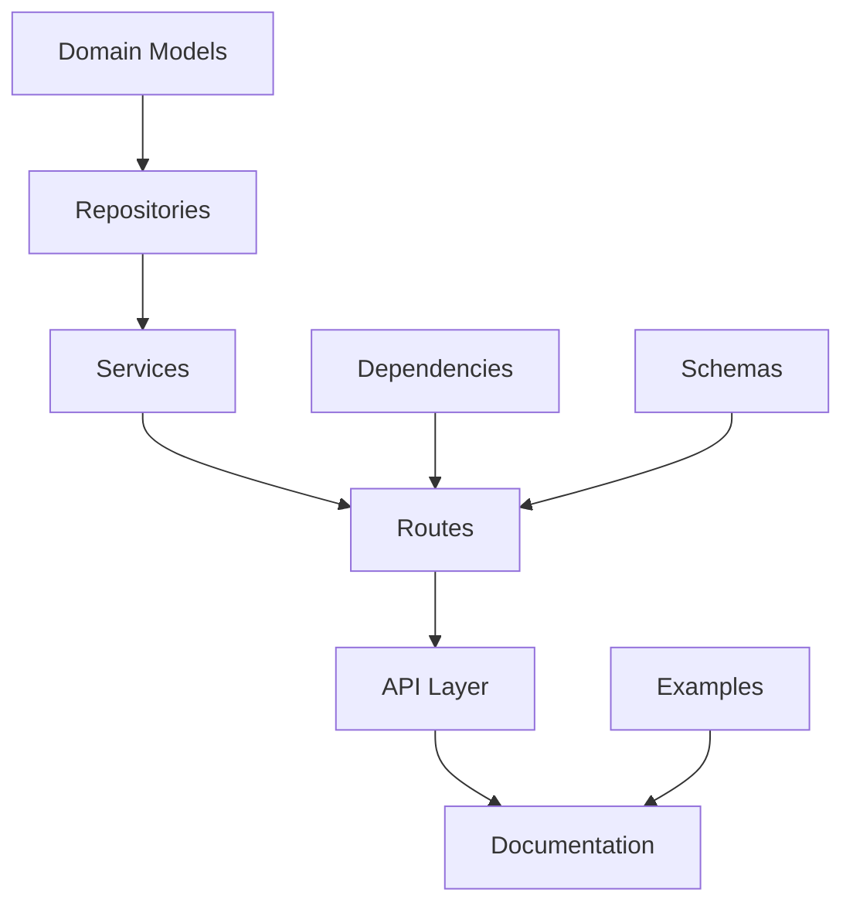

# AriesOne SaaS API Cross-Reference Documentation
Version: 1.0.0
Last Updated: 2025-01-12 18:47

## Overview
This document provides a comprehensive cross-reference of the AriesOne SaaS API components, showing how different parts of the system interact and depend on each other.

## Core Components

### 1. Database Layer
- **Base Repository** (`app/core/database/base_repository.py`)
  - Provides common database operations
  - Used by: All entity-specific repositories
  - Dependencies: SQLAlchemy, Redis cache

### 2. Domain Models
- **Base Model** (`app/domain/models/base.py`)
  - Base class for all domain models
  - Used by: All entity models
  - Dependencies: SQLAlchemy, Pydantic

#### Entity Models
- **User Model** (`app/domain/models/user.py`)
  - Related Services: UserService
  - Related Repository: UserRepository
  - Related Routes: auth.py, users.py
  - Related Schemas: auth.py, user.py

- **Organization Model** (`app/domain/models/organization.py`)
  - Related Services: OrganizationService
  - Related Repository: OrganizationRepository
  - Related Routes: organizations.py
  - Related Schemas: organization.py

- **DMERC Model** (`app/domain/models/dmerc.py`)
  - Related Services: DMERCService
  - Related Repository: DMERCRepository
  - Related Routes: dmerc.py
  - Related Schemas: dmerc.py

### 3. Repositories
- **Base Repository** (`app/repositories/base_repository.py`)
  - Implements: CRUD operations, caching, error handling
  - Used by: All entity repositories

#### Entity Repositories
- **User Repository** (`app/repositories/user_repository.py`)
  - Dependencies: BaseRepository
  - Used by: UserService
  - Methods:
    - get_by_email
    - get_by_username
    - search_users
    - update_password
    - verify_email

- **Organization Repository** (`app/repositories/organization_repository.py`)
  - Dependencies: BaseRepository
  - Used by: OrganizationService
  - Methods:
    - get_by_code
    - get_hierarchy
    - get_members
    - add_member
    - remove_member

- **DMERC Repository** (`app/repositories/dmerc_repository.py`)
  - Dependencies: BaseRepository
  - Used by: DMERCService
  - Methods:
    - get_by_form_number
    - search_forms
    - add_attachment
    - get_attachments
    - get_history

### 4. Services
- **Base Service** (`app/services/base_service.py`)
  - Implements: Business logic, validation, metrics
  - Used by: All entity services

#### Entity Services
- **User Service** (`app/services/user_service.py`)
  - Dependencies: UserRepository
  - Used by: Auth routes, User routes
  - Key Features:
    - Authentication
    - Password management
    - Role management
    - Email verification

- **Organization Service** (`app/services/organization_service.py`)
  - Dependencies: OrganizationRepository
  - Used by: Organization routes
  - Key Features:
    - Organization management
    - Member management
    - Hierarchy management
    - Settings management

- **DMERC Service** (`app/services/dmerc_service.py`)
  - Dependencies: DMERCRepository
  - Used by: DMERC routes
  - Key Features:
    - Form management
    - Workflow management
    - Attachment handling
    - History tracking

### 5. API Layer

#### Dependencies
- **API Dependencies** (`app/api/dependencies.py`)
  - Implements: Service injection, authentication
  - Used by: All route modules
  - Key Features:
    - Service providers
    - Authentication middleware
    - User authorization

#### Schemas
- **Auth Schemas** (`app/api/schemas/auth.py`)
  - Used by: Auth routes
  - Examples: auth.py in docs/examples

- **User Schemas** (`app/api/schemas/user.py`)
  - Used by: User routes
  - Examples: users.py in docs/examples

- **Organization Schemas** (`app/api/schemas/organization.py`)
  - Used by: Organization routes
  - Examples: organizations.py in docs/examples

- **DMERC Schemas** (`app/api/schemas/dmerc.py`)
  - Used by: DMERC routes
  - Examples: dmerc.py in docs/examples

#### Routes
- **Auth Routes** (`app/api/routes/auth.py`)
  - Dependencies: UserService
  - Endpoints:
    - POST /auth/token (login)
    - POST /auth/password/reset
    - POST /auth/password/update
    - POST /auth/verify/{token}

- **User Routes** (`app/api/routes/users.py`)
  - Dependencies: UserService
  - Endpoints:
    - POST /users
    - GET /users/me
    - PATCH /users/me
    - GET /users/{user_id}
    - PATCH /users/{user_id}

- **Organization Routes** (`app/api/routes/organizations.py`)
  - Dependencies: OrganizationService
  - Endpoints:
    - POST /organizations
    - GET /organizations/{organization_id}
    - PATCH /organizations/{organization_id}
    - POST /organizations/{organization_id}/users
    - DELETE /organizations/{organization_id}/users/{user_id}

- **DMERC Routes** (`app/api/routes/dmerc.py`)
  - Dependencies: DMERCService
  - Endpoints:
    - POST /dmerc
    - GET /dmerc/{form_id}
    - PATCH /dmerc/{form_id}
    - POST /dmerc/{form_id}/submit
    - POST /dmerc/{form_id}/approve
    - POST /dmerc/{form_id}/deny
    - POST /dmerc/{form_id}/attachments

### 6. Documentation
- **API Documentation** (`app/api/docs/api_docs.py`)
  - OpenAPI schema configuration
  - Tag metadata
  - Error responses
  - Security schemes

#### Example Documentation
- **Auth Examples** (`app/api/docs/examples/auth.py`)
- **User Examples** (`app/api/docs/examples/users.py`)
- **Organization Examples** (`app/api/docs/examples/organizations.py`)
- **DMERC Examples** (`app/api/docs/examples/dmerc.py`)

## Component Dependencies Graph

## Common Flows

### 1. Authentication Flow
1. Client sends credentials to `/auth/token`
2. AuthRouter calls UserService.authenticate_user
3. UserService validates credentials using UserRepository
4. JWT token generated and returned

### 2. DMERC Form Submission Flow
1. Client creates form via POST `/dmerc`
2. DMERCRouter calls DMERCService.create_form
3. DMERCService validates and stores using DMERCRepository
4. Client uploads attachments via POST `/dmerc/{form_id}/attachments`
5. Client submits form via POST `/dmerc/{form_id}/submit`
6. Form status updated and notifications sent

### 3. Organization Management Flow
1. Admin creates organization via POST `/organizations`
2. OrganizationRouter calls OrganizationService.create_organization
3. OrganizationService validates and stores using OrganizationRepository
4. Admin adds users via POST `/organizations/{organization_id}/users`
5. Users assigned roles and permissions

## Error Handling
All components follow a consistent error handling pattern:
1. Repositories throw specific database exceptions
2. Services catch and transform to domain exceptions
3. Routes catch and transform to HTTP exceptions
4. Global exception handlers format error responses

## Metrics and Monitoring
Each layer contributes to system observability:
1. Repositories track database operations
2. Services track business operations
3. Routes track API usage
4. All layers report to metrics service

## Security Measures
1. Authentication via JWT tokens
2. Role-based access control
3. Input validation at schema level
4. SQL injection protection
5. CORS configuration
6. Rate limiting

## Performance Optimizations
1. Database connection pooling
2. Redis caching
3. Async operations
4. Pagination
5. Efficient queries
6. Response compression
